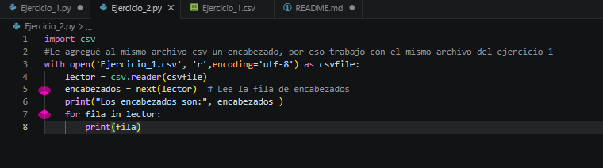
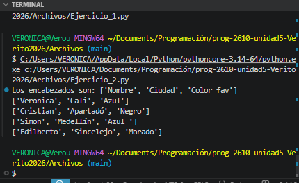
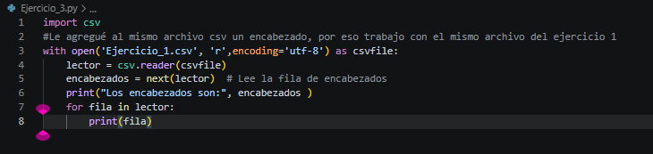
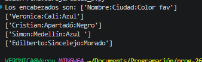
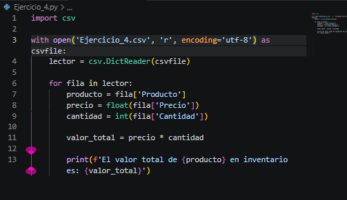
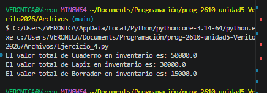
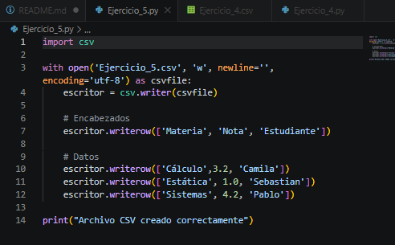
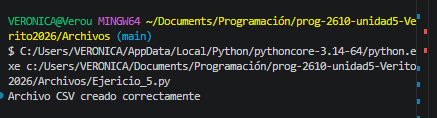
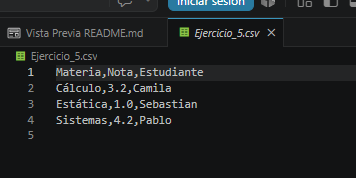

# Repositorio Unidad \#
## Información del estudiante
Nombre:  Veronica Alexandra Micanquer Moreno  
ID.:  000588473
## Descripción del repositorio
Aquí estarán las preguntas y tambien las evidencias de las actividades propuestas en el notion y en clase. 

# *Parte 1:Archivos de texto*

## **Preguntas de compresión ejercicio 1**
1. ¿Cuál es la diferencia en el resultado impreso entre la primera y la segunda llamada al método `read()`?  
A pesar de que es practicamente el mismo código, lo que se imprime es diferente, en el primer llamado del método se imprimen las 5 primeras letras del archivo, y en el segundo llamado se imprimen las otras 5 letras siguientes.
2. ¿Por qué no se imprimen los mismos datos en ambas lecturas, si el código es exactamente igual? *(Pista: Piensa en un "cursor" que avanza mientras lees).*  
En la primera lectura el cursor avanza las 5 primeros caracteres, y se queda en esa posición(despues del caracter numero 5).Despues el cursor pasa por los  caracteres que siguen.
3. ¿Por qué es obligatorio utilizar el método `close()` al final?  
Es necesario para liberar la memoria.

## **Preguntas de comprensión ejercicio 2**

1. Al imprimir el resultado de `readlines()`, ¿qué estructura de datos (tipo de variable) observas en la consola?  
Se observa una lista.
2. ¿Notaste el símbolo `\n` al final de cada frase impresa? ¿Qué significa ese símbolo?
Ese simbolo representa un salto de linea,como si pasara de un renglón a otro.
## **Preguntas de comprensión ejercicio 3**

1. ¿Qué pasaría con el archivo `datos.txt` si ejecutas este mismo script 3 veces seguidas? ¿Tendrías 3 reportes o solo 1? ¿Por qué?  
Solo habría 1 reporte, porque el archivo se abre con modo "w", y este lo que hace es que sobrescribe el contenido anterior cada vez que se ejecuta el programa,borra lo que ya había.
2. Si quisieras que el programa guardara el historial completo de cada ejecución sin borrar el anterior, ¿qué modificarías en el código?  
Cambiaría el modo "w" por "a" para que el programa agregue la nueva información al final del archivo sin borrar la anterior.
## **Preguntas de comprensión ejercicio 4**

1. En el código del Ejercicio 4, ¿en qué línea exacta se cierra el archivo después de escribir el secreto?  
El archivo se cierra justo despues de la linea de archivo.write(datos).
2. ¿Por qué usar `with` hace que el código sea "más seguro" frente a fallas del sistema?  
Porque with cierra el archivo automáticamente incluso si ocurre un error o falla el programa, evitando que el archivo quede abierto o que se pierdan datos.
## **Preguntas de comprensión ejercicio 5**

1. ¿Cuál es la diferencia entre una ruta **absoluta** (ej: `C:/Usuarios/Juan/texto.txt`) y una ruta **relativa** (ej: `texto.txt`)?  
Una ruta absoluta contiene la dirección completa del archivo,es decir su ubicación, mientras que una ruta relativa busca el desde la carpeta en la que estamos ejecutando el código.
2. ¿Por qué es mejor usar `Path` (de la librería `pathlib`) en lugar de simplemente concatenar textos como `"carpeta" + "/" + "archivo.txt"`?  
Porque Path maneja las rutas de forma automática y compatible con Windows, Mac y Linux, así evitamos  errores con los separadores (/ y \)  
## **Preguntas de comprensión ejercicio 6**

1. ¿Qué sucedería en el código del Ejercicio 6 si no usas `try-except` y el usuario ingresa un archivo inexistente? ¿Llegaría a imprimirse la frase "Fin del programa..."?  
El programa  presentaría un error (FileNotFoundError)  y no se imprimiría "Fin del programa...".
2. Además de `FileNotFoundError`, ¿qué otro problema del mundo físico/real crees que podría causar un error al intentar guardar datos en un archivo?
Podría ser que el disco esté lleno,no tener permisos para guardar,o que el archivo esté bloqueado por otro programa.

# *Parte 2:Archivos csv*
## **Primer ejercicio** 

## **Segundo ejercicio**

## **Tercer ejercicio**

  

¿Qué sucede?
Cuando intenté leer el archivo otra vez, los datos ya no salían separados como antes. En vez de mostrar cada dato por separado, aparecía toda la línea junta.

¿Cuál es la causa?
Esto pasa porque cambié las comas por dos puntos (:). El programa csv.reader() normalmente busca comas para separar los datos, entonces al no encontrarlas no sabe cómo dividir la información.

¿Cómo se puede solucionar?
La solución es decirle al programa que ahora el separador es : usando delimiter=':', para que pueda volver a leer los datos correctamente.
## **Cuarto Ejercicio**

## **Quinto ejercicio**

